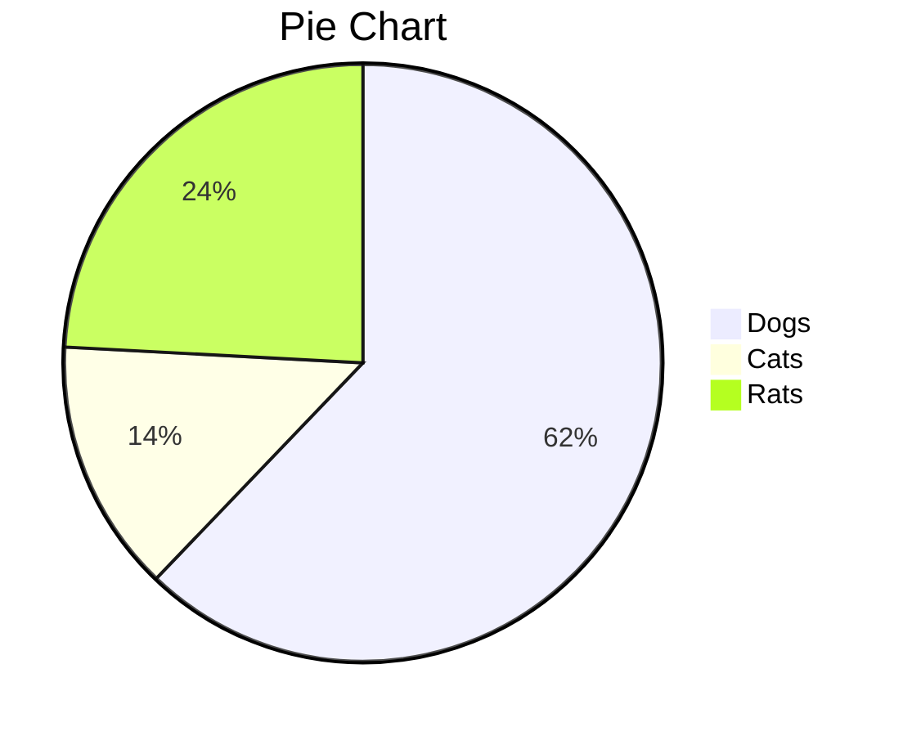

---
Test
---

- [1. Test](#1-test)
- [This is the best](#this-is-the-best)
  - [1.1. This gets better](#11-this-gets-better)
    - [1.1.1. Deeper](#111-deeper)
      - [1.1.1.1. Deepest](#1111-deepest)
- [2. Next](#2-next)

# 1. Test

# This is the best

```powershell
Write-Host
```

1. Dies ist ein Test
2. Wuhuu
    - yes!
    - Bla
3. sdfsdf

## 1.1. This gets better

```powershell
Get-Help
```

### 1.1.1. Deeper

#### 1.1.1.1. Deepest

Das ist Text

# 2. Next


Column A | Column B | Column C| |
---------|----------|---------|---------|---------
 A1 | B1 | C1| |
 A2 | B2 | C2| |
 A3 | B3 | C3| |

|      |      |      |
| ---- | ---- | ---- |
|      |      |      |
|      |      |      |
|      |      |      |

1. Blabla
   Test
   sfdsdf
   gfhfg

> Test

[]: .\test2.md

> [!TIP]
> Optional information to help a user be more successful

https://google.com

https://google.com


----------------------- ------------------------------------
:smile: Table multiline text bla bla bla bla
                        bla bla bla bla bla bla bla ... the
                        blank line below is important 

----------------------------------------------------------------

----------------------- ------------------------------------
:smile:\ Table multiline text bla bla bla bla
                        bla bla bla bla bla bla bla ... the
                        blank line below is important 

----------------------------------------------------------------

